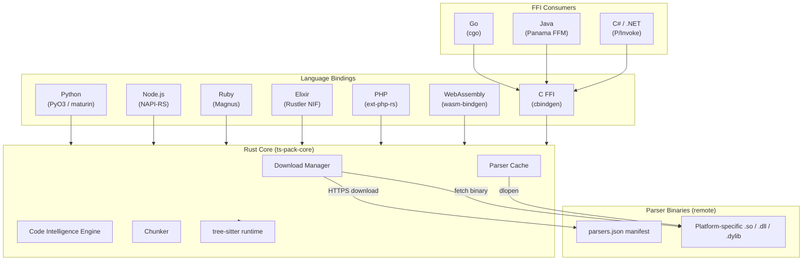

## Overview

tree-sitter-language-pack follows a layered architecture: a single Rust core library handles all parsing logic, and thin binding layers expose that API natively in each target language. No business logic lives in the bindings — they are pure translation layers.



## Rust Core (`crates/ts-pack-core`)

The core crate is where all logic lives:

- **Download Manager** — resolves the remote manifest, fetches platform-specific parser binaries, and stores them in the local cache directory.
- **Parser Cache** — maps language names to loaded `tree_sitter::Language` values. Once loaded, a parser is reused without re-reading from disk.
- **Code Intelligence Engine** — runs tree-sitter queries against a parsed tree to extract structure, imports, exports, symbols, comments, and docstrings.
- **Chunker** — walks the syntax tree and splits source code at natural boundaries, respecting a configurable token budget.

The core has no language-specific code. It calls `tree-sitter` through its stable C ABI using dynamically loaded parser binaries.

## Binding Layer

Each binding is a thin crate that:

1. Calls Rust core functions.
2. Converts Rust types to the host language's native types (`String` → `str`, `Vec<T>` → list/array, `Result<T, E>` → exception/error).
3. Exposes an idiomatic API matching the host language's conventions.

The binding crates contain no parsing logic, no query definitions, and no chunking code. This keeps bindings small and easy to maintain.

| Crate | Framework | Distribution |
|-------|-----------|--------------|
| `ts-pack-python` | PyO3 + maturin | PyPI wheels |
| `ts-pack-node` | NAPI-RS | npm (multi-platform) |
| `ts-pack-ruby` | Magnus | RubyGems native gem |
| `ts-pack-elixir` | Rustler NIF | Hex.pm |
| `ts-pack-php` | ext-php-rs | Packagist |
| `ts-pack-wasm` | wasm-bindgen | npm (WASM) |
| `ts-pack-ffi` | cbindgen (C FFI) | GitHub releases |
| `packages/go` | cgo | Go modules |
| `packages/java` | Panama FFM | Maven Central |
| `packages/csharp` | P/Invoke | NuGet |

## Parser Binaries

Tree-sitter parsers are not compiled into the package. Instead:

1. A `parsers.json` manifest (hosted on GitHub releases) lists all 305 languages with their download URLs per platform.
2. On first use of a language, the matching binary is downloaded and written to the local cache directory.
3. The binary is opened at runtime with `dlopen` / `LoadLibrary` and the `tree_sitter_<language>` symbol is resolved.

This keeps installation fast and download sizes minimal. See [Download Model](download-model.md) for the full detail.

## Repository Layout

```text
tree-sitter-language-pack/
├── crates/
│   ├── ts-pack-core/       # Rust core library
│   ├── ts-pack-python/     # Python (PyO3) binding
│   ├── ts-pack-node/       # Node.js (NAPI-RS) binding
│   ├── ts-pack-ruby/       # Ruby (Magnus) binding
│   ├── ts-pack-elixir/     # Elixir (Rustler) NIF
│   ├── ts-pack-php/        # PHP (ext-php-rs) extension
│   ├── ts-pack-wasm/       # WebAssembly (wasm-bindgen) binding
│   ├── ts-pack-ffi/        # C FFI for Go / Java / C#
│   └── ts-pack-cli/        # CLI binary
├── packages/
│   ├── go/v1/              # Go module (cgo wrapper)
│   ├── java/               # Java package (Panama FFM)
│   ├── csharp/             # C# / .NET package (P/Invoke)
│   └── php/                # PHP Composer wrapper
├── sources/
│   └── language_definitions.json  # Grammar source registry
├── scripts/
│   └── generate_readme.py  # README sync tooling
└── tools/
    └── e2e-generator/      # Test suite generator
```

## Design Principles

**Single source of truth**: All parsing and intelligence logic lives in `ts-pack-core`. Binding crates are pure glue.

**On-demand downloads**: Parsers are not shipped in the package binary. They are fetched and cached per-platform when first needed.

**ABI stability**: The C FFI layer (`ts-pack-ffi`) follows strict semantic versioning. The Go, Java, and C# bindings depend on a stable C ABI, not Rust internals.

**Zero duplication**: Query definitions, chunking strategies, and intelligence extraction are each written once in Rust and reused across all 11 language surfaces.
